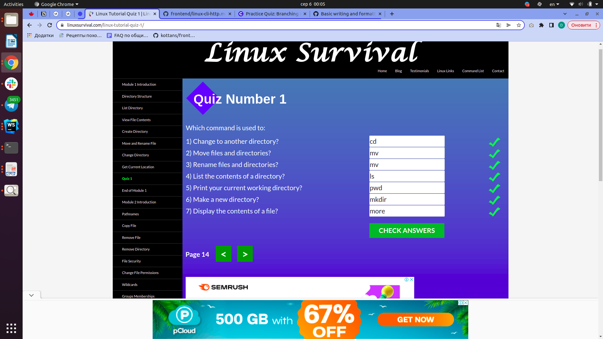
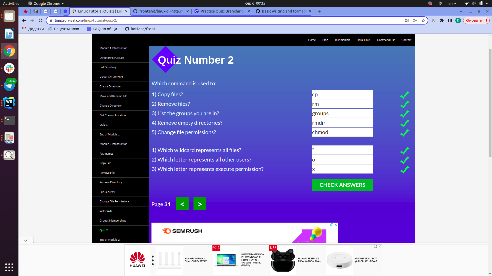
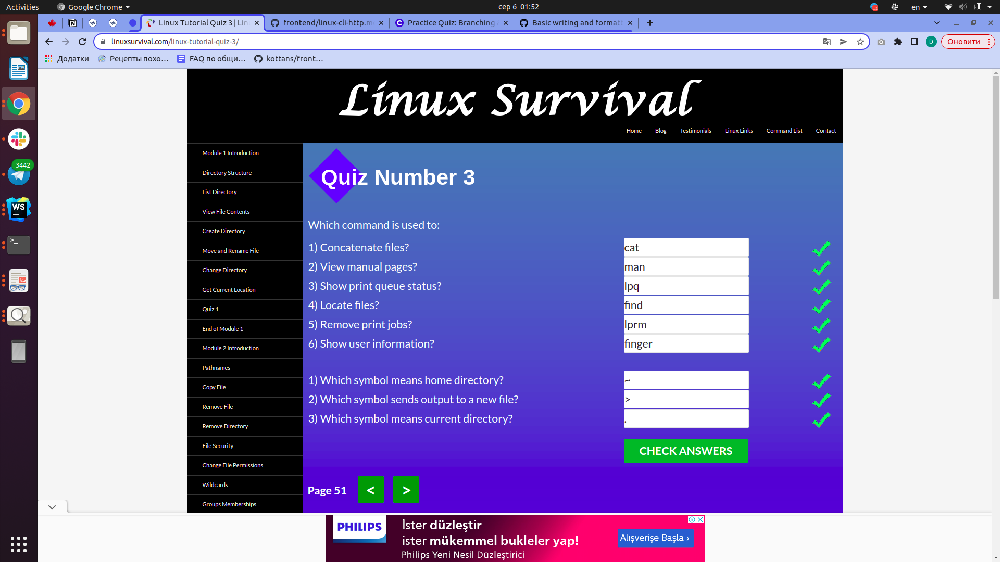
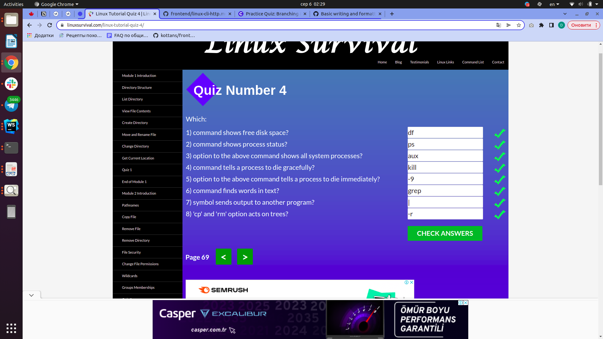

# Kottans Frontend Course
## Stage 0
Цей репозиторій складається з завдань, що я виконую під час проходження курсу з front-end від спільноти [Kottans](https://github.com/kottans).

## 1. Git та Github
 
- Раніше мені вже доводилось використовувати git репозиторії і деякі команди, але ці знання можна було назвати скоріше фрагментарними. Завдяки матеріалам 1-2 тижднів курсу з Git на Coursera, я зрозуміла послідовність *working tree - stage - commit* і відповідне застосування команд. Новою у цьому курсі була інформація про Commit ID і як вони запезпечують узгодженість комітів. Також цікавим було дізнатись про команди diff і patch, завдяки яким, теоретично, можна здійснювати контроль версій проекту без використання git. Але як добре, що git таки існує, і можна полегшити процес розробки завдяки цьому інструменту :)
- Тренажер на початку дещо заплутав тим, що потрібно починати вже безпосередньо з git commit, але в процесі проходження рівнів прийшло більше розуміння щодо роботи з гілками та віддаленим репозиторієм.

Загалом, я знайшла цікавими навчальні матеріали з цієї секції, а ще - краще зрозуміла, чому важливо використовувати систему контролю версій під час роботи над проектом.

## 2. Linux CLI, and HTTP
Нижче подані результати пройдених мною чотирьох модулів [Linux Survival](https://linuxsurvival.com/linux-tutorial-introduction/).

### Мої враження від матеріалів даної секції:
Linux Survival:
- Дізналась багато нових команд для роботи з директоріями та файлами, зокрема для їх створення, видалення, копіювання. Також дізналась про дозволи на читання, редагування та запуск файлів, краще зрозуміла ідею навігації між файлами - відносний та абсолютний шляхи.
- Здивувала відмінність Linux та Windows систем - у Linux завжди тільки одне directory tree, тоді як Windows використовує окреме directory tree для кожного диску, що ніяк не перетинаються між собою. Думаю, такі відмінності у системах можуть бути дуже важливими для розробників ПЗ.
- Абсолютно точно використовуватиму базові команди Linux під час роботи над проєктами - як мінімум, для навігації між директоріями та перегляду їх вмісту, інформації щодо їх дозволів. З розглянутих у курсі команд є сумніви щодо регулярного використання хіба що команд для друку файлів.

HTTP part 1:
- Ознайомилась з протоколом HTTP, його основними характеристиками, а також його застосуванням. Завдяки статті також пригадала рівні мережевих протоколів та структуру URL-адреси.
- Цікаво було дізнатись, як HTTP оновлювався, завдяки чому HTTP/2.0 дозволяє клієнту одночасно відправляти декілька запитів.
- Під час розробки веб-застосунків я, ймовірно, використовуватиму зокрема заголовки запиту та відповіді у бібліотеках та фреймворках. Також у нагоді мені мають стати коди стану.

HTTP part 2:
- З цієї статті я більше дізналась про типи з'єднань HTTP, процес автентифікації, а також цифрові сертифікати, що використовуються у веб-додатках. Завдяки статті я також отримала краще уявлення щодо роботи з кешем та його використанням.
- Цікавим було дізнатись, що розширення HTTPS є важливим для підвищення захищеності веб-застосунку. А особливо - що безпеку з'єднання забезпечуватиме SSL шар, при цьому застосунок можна розробляти за схемою Basic Authentication, без додаткових надмірних складностей. Також цікавим було дізнатись, як публічний кеш допомагає покращувати user experience.
- Припускаю, що під час роботи над веб-застосунками мені неодноразово доведеться займатись процесом автентифікації, і, можливо, контролювати кешування.

Додаткові матеріали, до яких я маю намір повернутись:
- [ ] [How I taught myself to code in eight weeks](https://lifehacker.com/how-i-taught-myself-to-code-in-eight-weeks-511615189)
- [ ] [How JavaScript works: Deep dive into WebSockets and HTTP/2 with SSE + how to pick the right path](https://blog.sessionstack.com/how-javascript-works-deep-dive-into-websockets-and-http-2-with-sse-how-to-pick-the-right-path-584e6b8e3bf7)