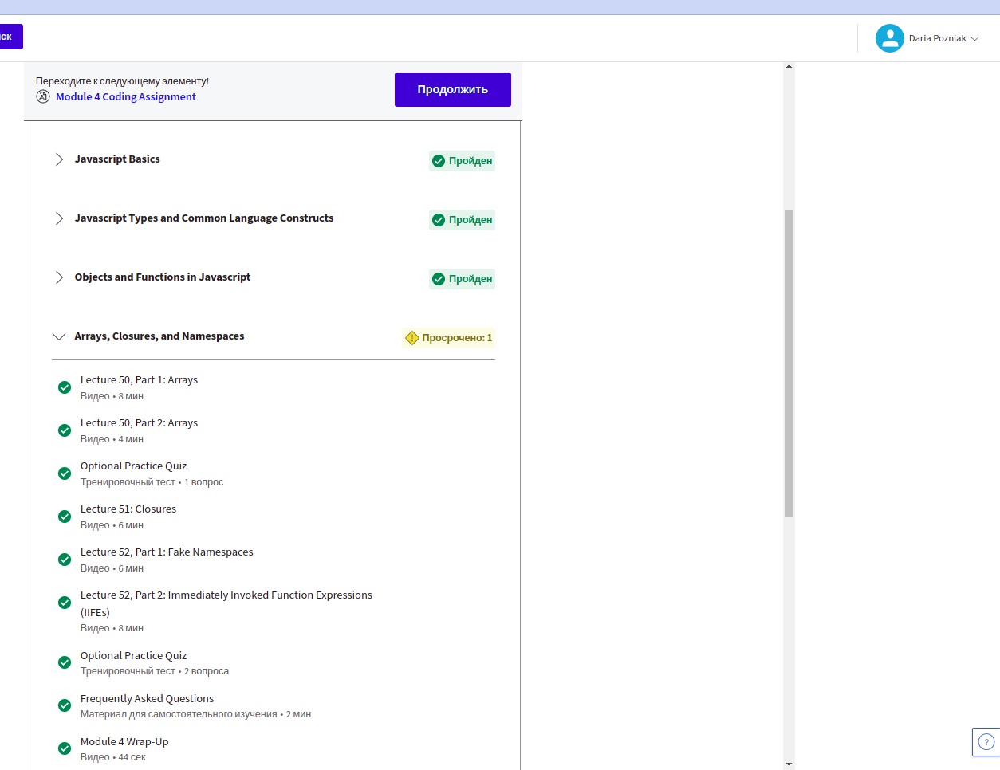
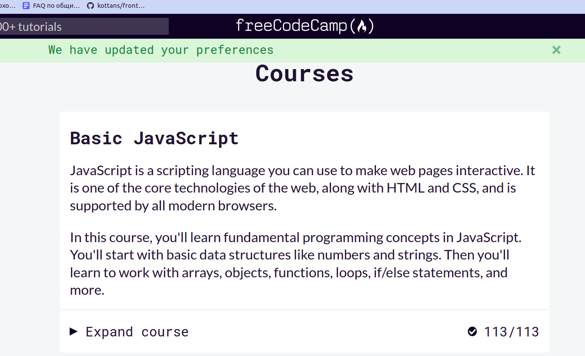
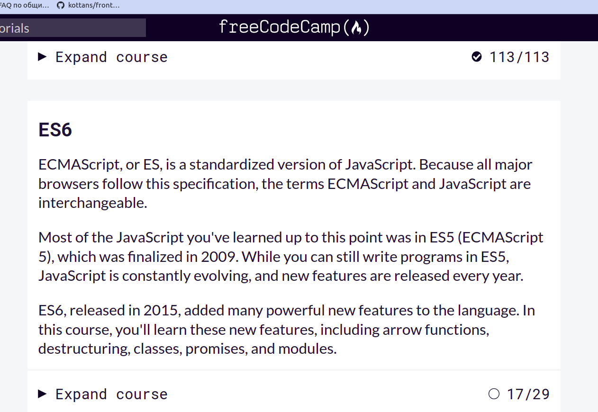
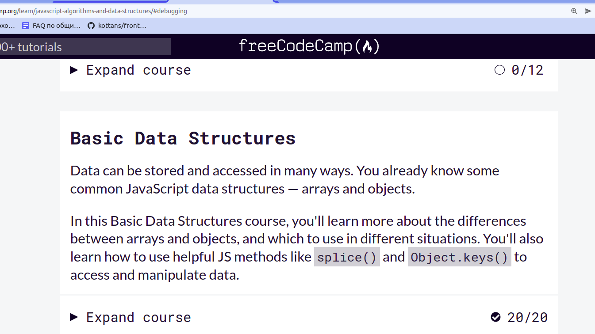
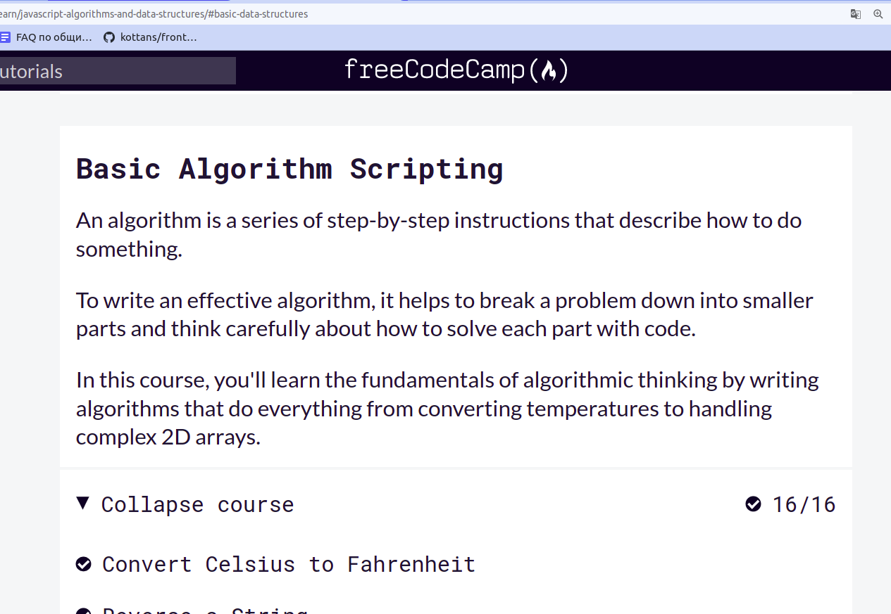
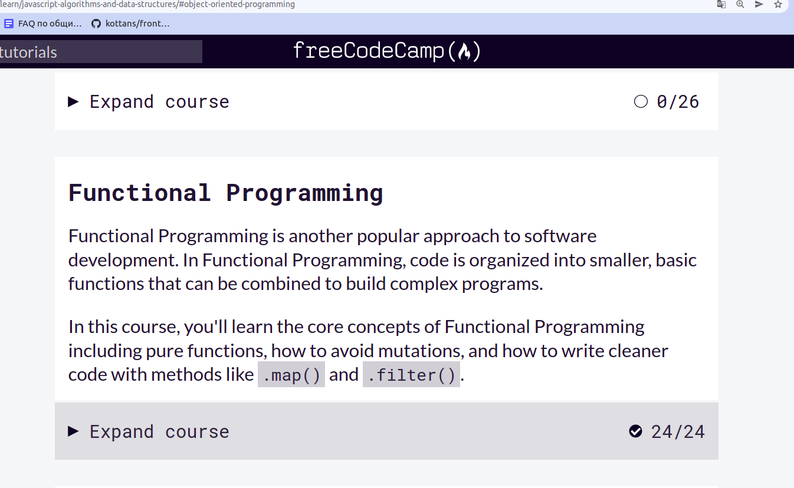
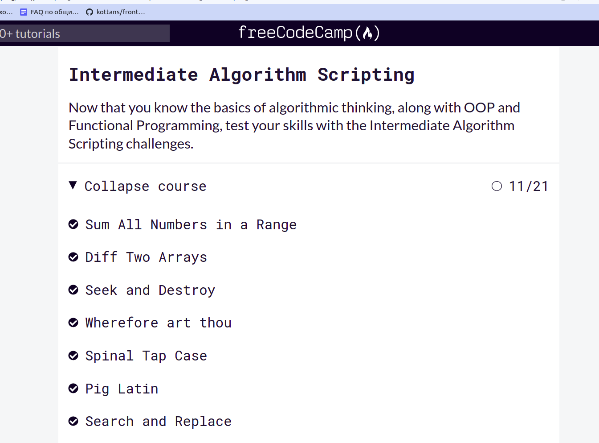
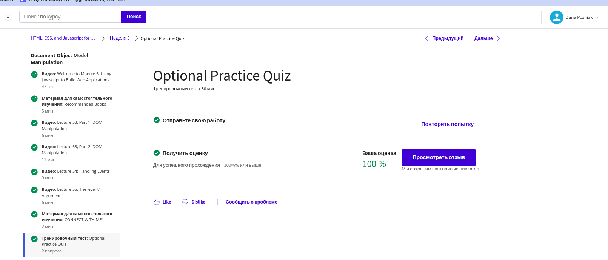

# Kottans Frontend Course

Цей репозиторій складається з завдань, що я виконую під час проходження курсу з frontend від спільноти [Kottans](https://github.com/kottans).

### Contents :bookmark_tabs:
1. **[Git and GitHub](https://github.com/d-pozniak/kottans-frontend#1-git-and-github)**
2. **[Linux, CLI and HTTP](https://github.com/d-pozniak/kottans-frontend#2-linux-cli-and-http)**
3. **[Git Collaboration](https://github.com/d-pozniak/kottans-frontend#3-git-collaboration)**
4. **[Intro to HTML and CSS](https://github.com/d-pozniak/kottans-frontend#4-intro-to-html-and-css)**
5. **[Responsive Web Design](https://github.com/d-pozniak/kottans-frontend#5-responsive-web-design)**
6. **[HTML CSS Popup](https://github.com/d-pozniak/kottans-frontend#6-html-css-popup)**
7. **[JS Basics](https://github.com/d-pozniak/kottans-frontend#7-javascript-basics)**
8. **[JS DOM](https://github.com/d-pozniak/kottans-frontend#8-js-dom)**

## 1. Git and Github

- Раніше мені вже доводилось використовувати git репозиторії і деякі команди, але ці знання можна було назвати скоріше фрагментарними. Завдяки матеріалам 1-2 тижднів курсу з Git на Coursera, я зрозуміла послідовність *working tree - stage - commit* і відповідне застосування команд. Новою у цьому курсі була інформація про Commit ID і як вони запезпечують узгодженість комітів. Також цікавим було дізнатись про команди diff і patch, завдяки яким, теоретично, можна здійснювати контроль версій проекту без використання git. Але як добре, що git таки існує, і можна полегшити процес розробки завдяки цьому інструменту :)
- Тренажер на початку дещо заплутав тим, що потрібно починати вже безпосередньо з git commit, але в процесі проходження рівнів прийшло більше розуміння щодо роботи з гілками та віддаленим репозиторієм.

Загалом, я знайшла цікавими навчальні матеріали з цієї секції, а ще - краще зрозуміла, чому важливо використовувати систему контролю версій під час роботи над проектом.

## 2. Linux CLI, and HTTP

### :camera: Скріншоти завершених уроків

дивитись тут

### Мої враження від матеріалів даної секції:
**Linux Survival:**
- Дізналась багато нових команд для роботи з директоріями та файлами, зокрема для їх створення, видалення, копіювання. Також дізналась про дозволи на читання, редагування та запуск файлів, краще зрозуміла ідею навігації між файлами - відносний та абсолютний шляхи.
- Здивувала відмінність Linux та Windows систем - у Linux завжди тільки одне directory tree, тоді як Windows використовує окреме directory tree для кожного диску, що ніяк не перетинаються між собою. Думаю, такі відмінності у системах можуть бути дуже важливими для розробників ПЗ.
- Абсолютно точно використовуватиму базові команди Linux під час роботи над проєктами - як мінімум, для навігації між директоріями та перегляду їх вмісту, інформації щодо їх дозволів. З розглянутих у курсі команд є сумніви щодо регулярного використання хіба що команд для друку файлів.

**HTTP part 1:**
- Ознайомилась з протоколом HTTP, його основними характеристиками, а також його застосуванням. Завдяки статті також пригадала рівні мережевих протоколів та структуру URL-адреси.
- Цікаво було дізнатись, як HTTP оновлювався, завдяки чому HTTP/2.0 дозволяє клієнту одночасно відправляти декілька запитів.
- Під час розробки веб-застосунків я, ймовірно, використовуватиму зокрема заголовки запиту та відповіді у бібліотеках та фреймворках. Також у нагоді мені мають стати коди стану.

**HTTP part 2:**
- З цієї статті я більше дізналась про типи з'єднань HTTP, процес автентифікації, а також цифрові сертифікати, що використовуються у веб-додатках. Завдяки статті я також отримала краще уявлення щодо роботи з кешем та його використанням.
- Цікавим було дізнатись, що розширення HTTPS є важливим для підвищення захищеності веб-застосунку. А особливо - що безпеку з'єднання забезпечуватиме SSL шар, при цьому застосунок можна розробляти за схемою Basic Authentication, без додаткових надмірних складностей. Також цікавим було дізнатись, як публічний кеш допомагає покращувати user experience.
- Припускаю, що під час роботи над веб-застосунками мені неодноразово доведеться займатись процесом автентифікації, і, можливо, контролювати кешування.

**Додаткові матеріали, до яких я маю намір повернутись:**
- [ ] [How I taught myself to code in eight weeks](https://lifehacker.com/how-i-taught-myself-to-code-in-eight-weeks-511615189)
- [ ] [How JavaScript works: Deep dive into WebSockets and HTTP/2 with SSE + how to pick the right path](https://blog.sessionstack.com/how-javascript-works-deep-dive-into-websockets-and-http-2-with-sse-how-to-pick-the-right-path-584e6b8e3bf7)

## 3. Git Collaboration

### :camera: Скріншоти завершених уроків

дивитись тут

### Мої враження від матеріалів даної секції:
**Introduction to Git and Github:**
- Дізналась більше про роботу з віддаленими репозиторіями, основні команди та типові сценарії використання Git та Github.
- Було цікаво дізнатись, які можливості для роботи з репозиторіями відкриває команда rebase. Іще цікаво було побачити сформульований список поширених помилок, що знаходять при code review.

**Learn Git Branching:**
- Закріпила набуті знання про git rebase, git pull та інші команди за допомогою візуального зображення working tree.
- Цікаво було спробувати cherry pick, який, виявилось, може бути корисним інструментом, хоч і дещо незвичним на перший погляд.

Старатимусь застосовувати набуті знання, щоразу працюючи над своїми проектами та використовуючи Github.

## 4. Intro to HTML and CSS

### :camera: Скріншоти завершених уроків

дивитись тут

### Мої враження від матеріалів даної секції:
**Intro to HTML & CSS:**
- Дізналась більше теоретичних відомостей щодо HTML. CSS розділ дозволив ще раз закріпити знання про box model та позиціонування елементів на сторінці.
- Було цікаво почути більше про організації, відповідальні за стандарти HTML: W3C, WHATWG.

**CodeAcademy:**
- Було цікаво додати до html сторінки відео та аудіо - робила це вперше, не замислювалась до цього, що для них також є default browser settings.

Безперечно, верстання є дуже важливою навичкою для фронт-енд розробника, і його основи я використовуватиму щоразу створюючи нові веб-сторінки, а також забезпечуючи роботу існуючих.

## 5. Responsive Web Design

### :camera: Скріншоти завершених уроків

дивитись тут

### Мої враження від матеріалів даної секції:
**Responsive web design basics:** 
Цікава стаття, що, як мені здалось, охоплює основні моменти щодо забезпечення адаптивності сторінки.
- Краще зрозуміла, для чого потрібно прописувати `width=device-width` та `initial-scale=1`, побачити використання `autofill` для grid.
- Цікаво було дізнатись, що для кращого сприйняття текстової інформації кількість знаків у рядку маж бути близько 70-80.
- Крім згаданих у статті flex і grid буду старатись мінімізовувати кількість брейкпойнтів під час верстання, орієнтуючись безпосередньо на контент сторінки, а не на існуючі на ринку пристрої.

**Відео з YouTube каналу [Фрілансер по життю](https://www.youtube.com/c/FreelancerLifeStyle)**:
- Дозволили систематизувати раніше набуті фрагментарні знання щодо FlexBox та Grid, чудова підкріплена практикою теорія. Згадала про значення проперті flex-wrap, дізналась про неявну сітку.
- Зацікавило, що можна іменувати лінії сітки, що може спростити роботу з нею.
- Точно і далі використовуватиму Flex у своїх проєктах, а також тепер не боятимусь Grid. Тож зможу приймати рішення на користь підходящої технології, не обмежуючись лише флексами :slightly_smiling_face:.

**Flexbox Froggy та Grid Garden:** 
Чудові ігри, щоб отримати базове розуміння технологій Flex і Grid.
- Цікаво було згадати проперті `align-content` для flexbox, ніколи ще не доводилось її використовувати під час верстання.

## 6. HTML CSS Popup

[Demo](https://d-pozniak.github.io/html-css-popup/) | 
[Code Base](https://github.com/d-pozniak/html-css-popup)
### Мої враження від матеріалів даної секції:
Іще чекаю на перевірку свого PR, але точно вже можу сказати, що було цікаво дізнатись про таку імплементацію дропдауна/попап меню, без використання 
js. Також вперше у верстанні власноруч використала CSS Grid. Було важко вигадати цікавий, цілісний дизайн, тож врешті решт просто сфокусувалась на 
реалізації загальної логіки, вказаної у вимогах.

## 7. JavaScript Basics

### :camera: Скріншоти завершених уроків

дивитись тут

### Мої враження від матеріалів даної секції:
**Coursera JS Basics:** 
Загальний невеличкий курс, що дав мені можливість повторити матеріал по JS, що я починала вивчати декілька місяців тому. Припускаю, що він був би
зовсім важким для мого розуміння, якби я дивилась його, нічого не знаючи про жодну мову програмування.
- Дізналась про IIFE та прототипи у об'єктів, пригадала, які типи існують у JavaScript.
- Цікаво було більше дізнатись про копіювання за значенням та за посиланням - у чому полягає різниця. Сподобалась наочна схема (нехай і примітивна)
щодо зберігання даних у пам'яті. Ніколи до цього не замислювалась далі "reference тип зберігає посилання на об'єкт".

**FreeCodeCamp:** 
- Дізналась про різні методи для роботи з масивами, які раніше здавались трохи магічними (map, reduce, slice), а тепер старатимусь використовувати
їх за можливості, адже вони виявились дійсно зручними та корисними :)
- Дізналась про принципи функціонального програмування, концепцію "чистих функцій" та "функцій вищого порядку"
- Цікавим було вирішувати завершальні 11 задач - трохи помучилась з регулярними виразами, але завдяки цьому тепер хоч трохи розумію їх логіку.
- Також цікавим було більш чітко побачити риси саме ES6, розв'язуючи задачі у цьому виклику. 
- Окремо сподобались приклади багатовимірних масивів та об'єктів. Відчуваю, що на практиці можуть бути ще масштабніші набори даних, треба 
вміти в них орієнтуватись.
- Сподіваюсь, тепер точно запам'ятаю, чому використовувати var - погана практика :) 

## 8. JS DOM

### :camera: Скріншоти завершених уроків

дивитись тут

### Мої враження від матеріалів даної секції:
**Coursera DOM Manipulation:** 
- Дізналась, що існують різні типи івентів, що дозволяють реалізувати сценарії взаємодії користувача з вебсторінкою.
- Було цікаво побачити, як за допомогою eventListener розміщувати посилання на файл з js-скриптом на початку html-сторінки, при цьому не порушуючи послідовність
завантаження контенту. Також вразила можливість за допомогою eventListener відстежувати навіть положення курсору на сторінці.
- Використовуватиму DOM підхід для реалізації взаємодії у своїх вебсторінках. Впевнена, мені знадобиться querySelector та відстежування подій :)
